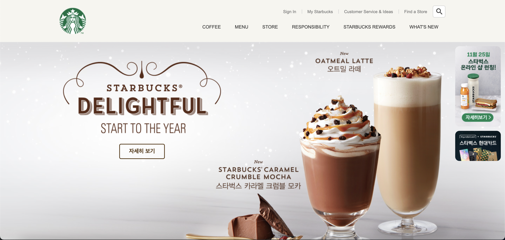

# Starbucks

HTML, CSS, JS를 이용한 스타벅스 홈페이지 콜론코딩

## 프로젝트를 통해 배운점

* gsap을 이용해 애니메이션 추가하기

* ScrollMagic을 이용해 요소의 위치에 따른 애니메이션 추가하기
 
* youtube iframe API를 이용해 유튜브 영상 가져오기
 
* swiper API를 이용해 슬라이드 만들기
